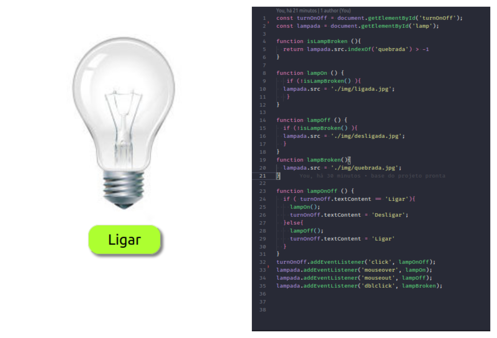

# Projeto Lâmpada

## Descrição do projeto
#### Este projeto foi feito para aprimorar meu conhecimento em JavaScript.
- O Objetivo é ligar e desligar a lâmpada com o botão abaixo dela ou clicando sobre a lâmpada, é possivel ligar e desligar. Ao clicar duas vezes a lâmpada é quebrada

## ✔️ Tecnologias utilizadas

- ``HTML``
- ``CSS``
- ``JavaScript``
